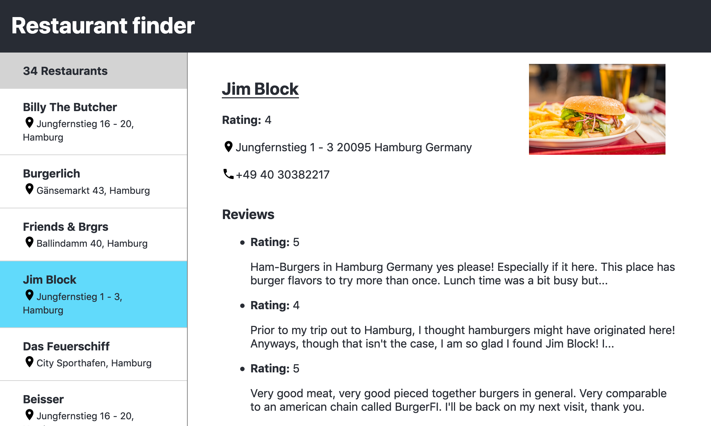

# React – Coding Challenge

## Task
* Create a simple page that shows a list of restaurants in a navigation.
* The details of a restaurant are displayed by clicking on an entry in the navigation.
* Pick up the styles from the screenshot below.



## Start

Start application with
```sh
yarn start # opens a page on http://localhost:3000/
```

**You will find all required sources in the `src/` directory. The data is in the file `data.json`.**
<br>
<br>
<br>
<br>

## Installation

See the [installation guide](installation.md).
